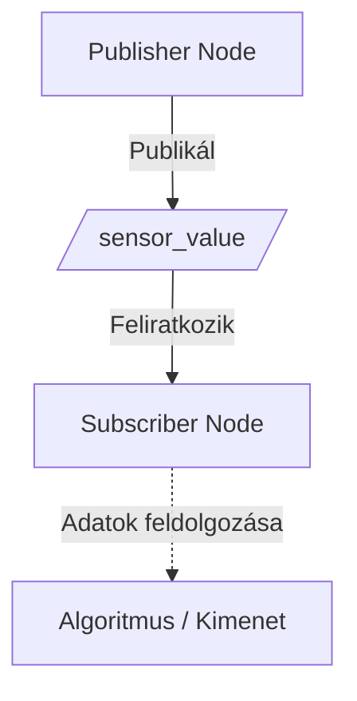
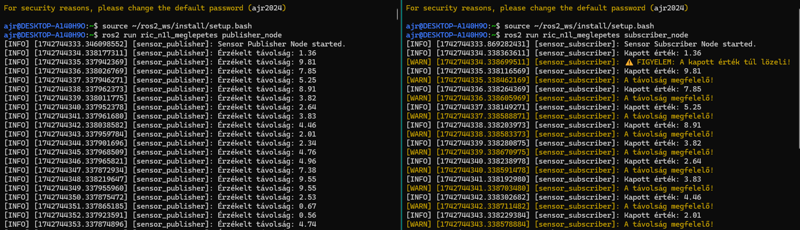

# `ric_n1l_meglepetes` package
A package két node-ból áll. A publisher_node egy véletlen számot generál, amit sensor_value néven hirdet. A subscriber_node erre feliratkozik, majd megnézi hogy a kapott szám kisebb e a határértéknél(2). Majd kiírja a megfelelő választ.


Megvalósítás Windows WSL2 alatt.

## Packages and build
It is assumed that the workspace is `~/ros2_ws/`.

### Clone the packages
``` r
cd ~/ros2_ws/src
```
``` r
git clone https://github.com/horvricsi/ric_n1l_meglepetes
```

### Build ROS 2 packages
``` r
cd ~/ros2_ws
```
``` r
colcon build --packages-select ric_n1l_meglepetes --symlink-install
```

<details>
<summary> Don't forget to source before ROS commands.</summary>

``` bash
source ~/ros2_ws/install/setup.bash
```
</details>

### Két külön terminálba futassuk a node-okat

``` r
ros2 launch ric_n1l_meglepetes launch_example1.launch.py
```

``` r
ros2 run ric_n1l_meglepetes publisher_node
```

``` r
ros2 run ric_n1l_meglepetes subscriber_node
```

### Graph




