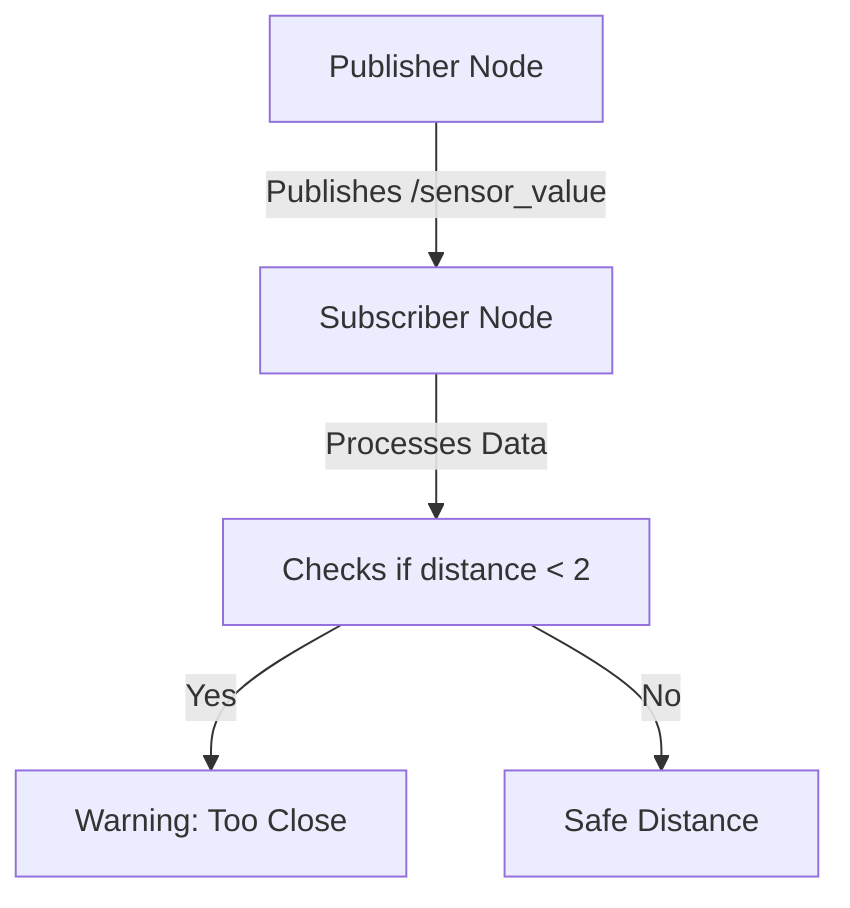

# ROS 2 Kis Beadandó – Távolságfigyelő Rendszer

##  Projekt Leírás
Ez a ROS 2 csomag egy egyszerű **távolságfigyelő rendszert** valósít meg egy **publisher és egy subscriber** node segítségével.
- A **publisher** véletlenszerű távolságértékeket generál és elküldi egy topicra.
- A **subscriber** fogadja az adatokat, és kiírja, hogy a távolság **biztonságos** vagy **túl közeli**.

##  Telepítés és Futatás
### 1️⃣ Csomag letöltése és buildelése
```bash
cd ~/ros2_ws/src
git clone https://github.com/horvricsi/ric_n1l_meglepetes.git
cd ~/ros2_ws
colcon build
```

### 2️⃣ Környezet beállítása
```bash
source install/setup.bash
```
### 3️⃣ Node-ok futtatása (2 külön terminálban)
```bash
ros2 run my_package distance_publisher
```
```bash
ros2 run my_package distance_subscriber
```

## Node-ok és Topicok
Node: sensor_publisher <br>
Funkció: Generál és elküld egy véletlenszerű távolságot <br>
Kapcsolódó Topic: /sensor_value <br>
<br>
Node: sensor_subscriber <br>
Funkció: Fogadja a távolságadatokat, és eldönti, hogy túl közeli-e <br>
Kapcsolódó Topic: /sensor_value <br>

## Működés
Ha a generált távolság 2 méter alatt van, a subscriber figyelmeztet, hogy túl közeli. <br>
Ha pedig 2 méter fölött van, akkor mondja, hogy megfelelő.

## Graph


``` mermaid
graph TD;
    A[Publisher Node] -->|Publishes /sensor_value| B[Subscriber Node];
    B -->|Processes Data| C[Checks if distance < 2];
    C -- Yes --> D[Warning: Too Close];
    C -- No --> E[Safe Distance];
```


